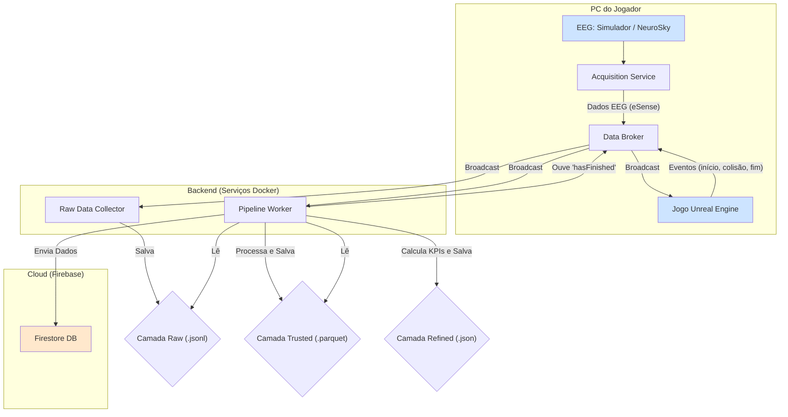
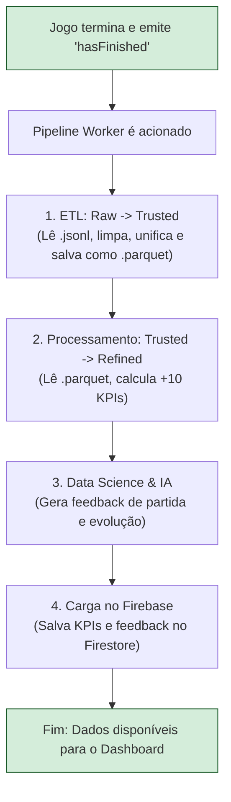

# NeuroRace: Plataforma de Neurofeedback Gamificado

**NeuroRace** é uma plataforma completa que transforma a concentração, medida por dados de EEG, em uma competição de corrida gamificada. Desenvolvido para ser uma das atrações de destaque na **Iniciação Científica do Next FIAP**, o projeto vai além de um simples jogo, incorporando um **pipeline de dados automatizado** para análise de performance cognitiva em tempo real.

Os jogadores competem em um runner de tela dividida, onde a velocidade é controlada pelo seu nível de foco. Ao final de cada corrida, a plataforma analisa o desempenho, gera mais de 10 KPIs cognitivos e fornece um **feedback de coaching personalizado por IA**, permitindo que os jogadores entendam e melhorem sua performance mental.


---

## 🧩 Arquitetura Completa

O NeuroRace opera com uma arquitetura de microsserviços orientada a eventos, projetada para coleta, processamento e análise de dados em tempo real.



**Componentes Principais:**
1.  **Fonte de EEG** (`simulator.py` ou NeuroSky): Gera os dados brutos de ondas cerebrais.
2.  **Serviço de Aquisição** (`acquisition_service.py`): Lê, enriquece e publica os dados de EEG no Broker.
3.  **Data Broker** (`index.js`): Um hub Socket.IO que distribui todos os eventos (`eSense`, `gameEvent`) em tempo real.
4.  **Coletor da Camada Raw** (`raw_data_collector`): Ouve o broker e salva todos os dados brutos, sem filtro, em arquivos `.jsonl`. É a porta de entrada do nosso pipeline de dados.
5.  **Pipeline Worker** (`pipeline_worker`): O cérebro do nosso backend. Este serviço orquestrador é acionado pelo fim de uma corrida e executa automaticamente todo o pipeline de dados.

---

## 🔄 Fluxo de Dados Automatizado

O coração do projeto é um pipeline de dados automatizado que transforma dados brutos em insights acionáveis.



---

## 📁 Estrutura de Pastas Atualizada

```text
.
├── docker-compose.yml
├── data_broker/
├── data_pipeline/
│   ├── data/                 # Armazenamento local dos dados
│   │   ├── raw_data/
│   │   ├── trusted_data/
│   │   └── refined_data/
│   ├── pipeline_worker/      # Orquestrador e processador (ETL + Refined)
│   ├── raw_data_collector/   # Coletor de dados brutos
│   └── secrets/              # Armazena as credenciais do Firebase
├── eeg_acquisition/
├── images/
├── test_emitter.py           # Script para simular uma corrida completa
└── ...
```

---

## ⚙️ Como Rodar (Ambiente de Simulação Local)

O projeto utiliza **Docker Compose Profiles** para gerenciar diferentes cenários de execução. O perfil principal para desenvolvimento e teste é o `sim-local`.

1.  **Pré-requisitos:**
    *   Docker e Docker Compose instalados.

2.  **Build e Execução:**
    Na raiz do projeto, execute o comando para subir todos os serviços do perfil de simulação local (dois simuladores no mesmo PC).
    ```bash
    docker compose --profile sim-local up --build -d
    ```

Isso iniciará todos os serviços necessários, incluindo os simuladores, o broker e todo o pipeline de dados.

---

## 🧪 Testando o Pipeline de Ponta a Ponta

Para validar toda a arquitetura, do envio de dados até o salvamento no Firebase, utilizamos o `test_emitter.py`. Este script simula uma corrida completa, com múltiplos eventos, e aciona o pipeline automatizado.

1.  **Monitore o Orquestrador:**
    Em um terminal, observe os logs do `pipeline_worker` em tempo real. Ele estará aguardando o fim de uma corrida.
    ```bash
    docker compose logs -f pipeline_worker
    ```

2.  **Execute o Emissor de Teste:**
    Em outro terminal, execute o script.
    ```bash
    python test_emitter.py
    ```

3.  **Observe a Mágica:**
    Volte ao terminal do `pipeline_worker`. Você verá o pipeline ser acionado e executar todas as etapas: ETL, cálculo de KPIs e o envio final para o Firebase, incluindo a atualização dos perfis de usuário. Ao final, os dados estarão disponíveis no seu console do Firestore.

---

## 💾 A Pilha de Dados: Do Bruto ao Insight

Nossa arquitetura de dados é dividida em camadas, culminando no Firestore para consumo pelo front-end.

*   **Camada Raw (`.jsonl`):** Armazenamento de todos os eventos e dados de EEG brutos, sem filtros. A "memória" completa de cada corrida.
*   **Camada Trusted (`.parquet`):** Dados limpos, estruturados, unificados e enriquecidos. A "fonte única da verdade" para qualquer análise.
*   **Camada Refined (`.json`):** O sumário final, contendo os KPIs e o feedback do coach para cada jogador.

**Destino Final: Firestore**
O pipeline alimenta três coleções principais no Firestore, prontas para o front-end:
1.  `/sessions/{sessionId}`: Contém os KPIs detalhados e o **feedback da partida** para cada jogador daquela sessão.
2.  `/users/{userId}`: O perfil de cada jogador, com suas estatísticas agregadas (total de vitórias, recordes) e o **feedback de evolução** dinâmico.
3.  `/global_stats/summary`: Um documento único com estatísticas globais (médias, percentis) de todos os jogadores, usado para gerar contexto e comparações em tempo real.

---

## 🧠 Métricas e Coach Virtual (IA)

O pipeline calcula mais de 10 KPIs para cada jogador, incluindo:
*   **TZF (Tempo em Zona de Foco):** % do tempo em alta concentração.
*   **CVF (Consistência do Foco):** Nível de estabilidade da atenção.
*   **LFO (Latência para o Foco):** Tempo de recuperação mental após um erro.
*   **Tendência de Fadiga:** Análise da carga mental ao longo da corrida.

Com base nesses dados, nosso **Coach Virtual** gera dois tipos de feedback: uma análise da performance na partida e um relatório sobre a evolução do jogador ao longo do tempo.

---

## 🎮 Jogo (Unreal) — Status & Integração

**Status:** em desenvolvimento. O jogo é um **runner** com **tela dividida** e obstáculos. Já **recebe dados simulados** do Broker e ajusta a velocidade dos personagens conforme `attention`.

**Conexão esperada (lado do jogo):** cliente Socket.IO para `ws://<HOST_DO_BROKER>:3000`, escutando o evento:

```json
{ "player": 1 | 2, "attention": <float> }
```

> 
> *Legenda: Imagens do jogo em desenvolvimento.*

---

## 📊 Dashboard — Status & Demonstrações

**Status:** protótipo em teste (UI/estética em definição) — **não está neste repositório** ainda.

> 
> *Legenda: Prototipo do dashboard*

---

## 🗺️ Próximos Passos

Com a infraestrutura de dados completa e automatizada, o foco do projeto se volta para:
1.  **Front-end & Dashboard:** Construir as interfaces para visualizar os rankings, históricos de corridas e os feedbacks do coach, consumindo os dados diretamente do Firestore.
2.  **Integração com o Jogo:** Portar a lógica do `test_emitter.py` para o cliente do jogo em Unreal Engine, para que ele emita os eventos reais.
3.  **Deployment em Produção:** Migrar os serviços Docker para um ambiente de nuvem para garantir a disponibilidade durante o evento Next FIAP.

---

## 📄 Licença

Este projeto está sob a [MIT License](LICENSE).
